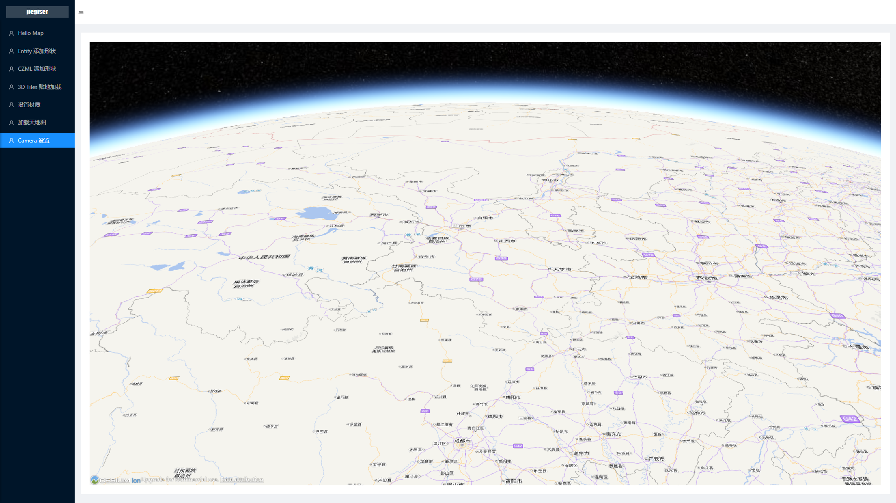
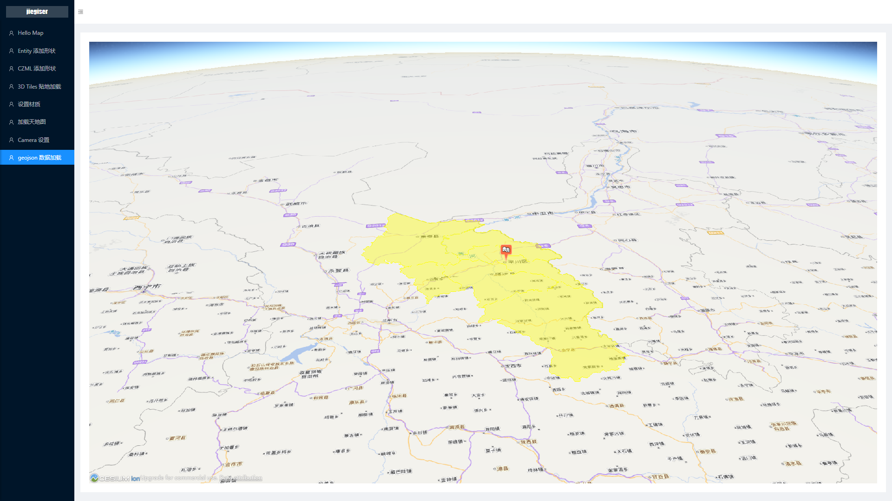

## 基于 react + Typescript + cesium 的项目

### 1. HelloMap（√）


### 2. Entity 添加图形（√）


### 3. CZML 添加图形（√）


### 4. 3D tiles 数据贴地加载（√）


### 5. 设置材质（√）


### 6. 加载天地图（√）


### 7. Camera 设置（√）



### 8. geojson 数据加载（√）




### cesium 相关知识
1. 深度检测 depthTestAgainstTerrain
```js
// 打开深度检测，那么在地形以下的对象不可见
viewer.scene.globe.depthTestAgainstTerrain = true;
```
2. 场景配置
```js
// 开启全球光照
viewer.scene.globe.enableLighting = true;
```
3. 相机控制

- Camera.setView(options) : 立即设置相机位置和朝向。
- Camera.zoomIn(amount) : 沿着相机方向移动相机。
- Camera.zoomOut(amount) : 沿着相机方向远离
- Camera.flyTo(options) : 创建从一个位置到另一个位置的相机飞行动画。
- Camera.lookAt(target, offset) : 依据目标偏移来设置相机位置和朝向。
- Camera.move(direction, amount) : 沿着direction方向移动相机。
- Camera.rotate(axis, angle) : 绕着任意轴旋转相机。

4. 时间控制
```js
// 设置时钟和时间线
viewer.clock.shouldAnimate = true; // 当viewer开启后，启动动画
viewer.clock.startTime = Cesium.JulianDate.fromIso8601("2017-07-11T16:00:00Z");
viewer.clock.stopTime = Cesium.JulianDate.fromIso8601("2017-07-11T16:20:00Z");
viewer.clock.currentTime = Cesium.JulianDate.fromIso8601("2017-07-11T16:00:00Z");
viewer.clock.multiplier = 2; // 设置加速倍率
viewer.clock.clockStep = Cesium.ClockStep.SYSTEM_CLOCK_MULTIPLIER; // tick computation mode(还没理解具体含义)
viewer.clock.clockRange = Cesium.ClockRange.LOOP_STOP; // 循环播放
viewer.timeline.zoomTo(viewer.clock.startTime, viewer.clock.stopTime); // 设置时间的可见范围

```
上述代码设定了场景动画播放速率，开始和结束时间，并且设置为循环播放。并且设置了时间线控件在合适的时间范围;
5. 通过时间点计算方位

Cesium 提供了 VelocityOrientationProperty，这个会根据 entity 的位置点信息和时间来自动计算朝向。
```js
// 基于无人机轨迹的位置点，自动计算朝向
drone.orientation = new Cesium.VelocityOrientationProperty(drone.position);
```
6. 3D Tiles 数据的样式设置
根据 Cesium3DTileFeature 模型属性去修改某一部分甚至某一栋建筑物的颜色（RGB 和透明度）。这些元素属性（feature property）通常存储在每个模型切片的 batchtable 中。元素属性可以是任意属性，比如高度，名称，坐标，创建日期等等。样式语言使用JSON格式定义，并且支持JavaScript的表达式（a small subset of JavaScript augmented）
```js
// 设置为白色
var defaultStyle = new Cesium.Cesium3DTileStyle({
    color : "color('white')",
    show : true
});
titlest.style = defaultStyle;
// 设置为半透明
var transparentStyle = new Cesium.Cesium3DTileStyle({
    color : "color('white', 0.3)",
    show : true
});
// 根据建筑物高度去着色
var heightStyle = new Cesium.Cesium3DTileStyle({
    color : {
        conditions : [
            ["${height} >= 300", "rgba(45, 0, 75, 0.5)"],
            ["${height} >= 200", "rgb(102, 71, 151)"],
            ["${height} >= 100", "rgb(170, 162, 204)"],
            ["${height} >= 50", "rgb(224, 226, 238)"],
            ["${height} >= 25", "rgb(252, 230, 200)"],
            ["${height} >= 10", "rgb(248, 176, 87)"],
            ["${height} >= 5", "rgb(198, 106, 11)"],
            ["true", "rgb(127, 59, 8)"]
        ]
    }
})
```
7. 拾取
有好几种拾取：
- Scene.pick : 返回窗口坐标对应的图元的第一个对象。
- Scene.drillPick :返回窗口坐标对应的所有对象列表。
- Globe.pick : 返回一条射线和地形的相交位置点。

拾取需要创建一个鼠标事件处理器：
```js
var handler = new Cesium.ScreenSpaceEventHandler(viewer.scene.canvas);
handler.setInputAction(function(movement) {}, Cesium.ScreenSpaceEventType.MOUSE_MOVE);
```
我们可以在回调函数里获得一个窗口坐标，并传递到 pick() 方法里。 如果拾取到一个 billboard 对象，我们就知道目前鼠标在一个图标上了。然后使用我们前面学过的相关 Entity 接口，去修改它的样式做高亮效果。
```js
var previousPickedEntity = undefined;
handler.setInputAction(function(movement) {
    var pickedPrimitive = viewer.scene.pick(movement.endPosition);
    var pickedEntity = (Cesium.defined(pickedPrimitive)) ? pickedPrimitive.id : undefined;
    // 取消上一个高亮对象的高亮效果
    if (Cesium.defined(previousPickedEntity)) {
        previousPickedEntity.billboard.scale = 1.0;
        previousPickedEntity.billboard.color = Cesium.Color.WHITE;
    }
    // 当前entity高亮
    if (Cesium.defined(pickedEntity) && Cesium.defined(pickedEntity.billboard)) {
        pickedEntity.billboard.scale = 2.0;
        pickedEntity.billboard.color = Cesium.Color.ORANGERED;
        previousPickedEntity = pickedEntity;
    }
}, Cesium.ScreenSpaceEventType.MOUSE_MOVE);

```
8. 相机跟随模式
如果我们需要将相机跟随一个图元，只需要简单的设置 viewer.trackedEntity 为需要跟随的图元，如果需要切换到自由模式（也就是默认模式），只需要把 viewer.trackedEntity 设置为 undefined，然后可以使用camera.flyTo() 返回到初始位置。
```js
function setViewMode() {
    // 设置跟随要素
    if (droneModeElement.checked) {
        viewer.trackedEntity = drone;
    } else {
        // 取消跟随模式
        viewer.trackedEntity = undefined;
        viewer.scene.camera.flyTo(homeCameraView);
    }
}
// 可以添加一些监听函数，来完成一些复杂功能
viewer.trackedEntityChanged.addEventListener(function() {
    if (viewer.trackedEntity === drone) {
        freeModeElement.checked = false;
        droneModeElement.checked = true;
    }
});

```
